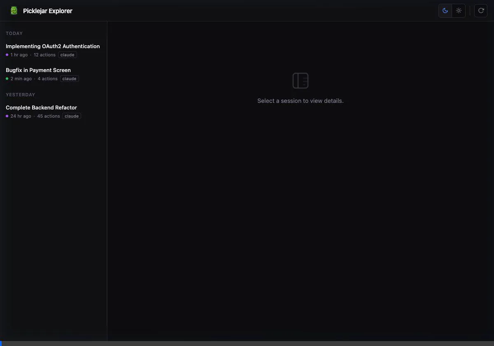
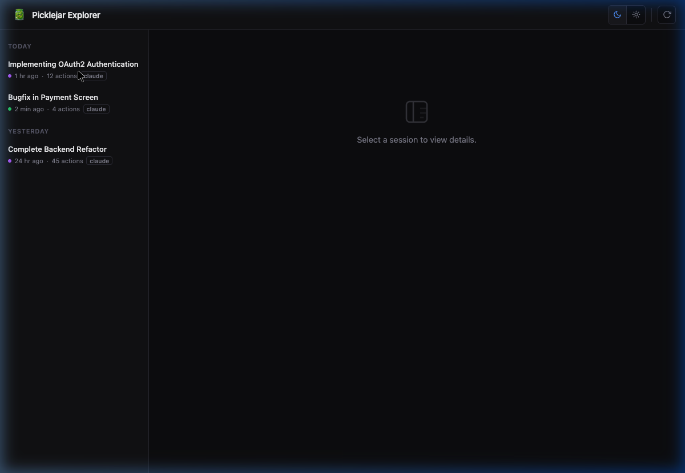
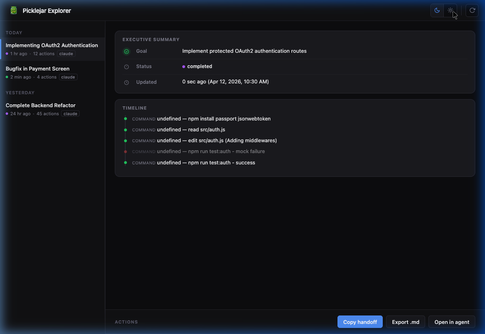

# picklejar-agent

Persist AI coding agent sessions with native hooks, versioned snapshots, and resumable handoff context.

Picklejar records tool activity under `.picklejar/snapshots/`, derives a trusted session view, and can generate a brain dump for resume, export, terminal handoff, or the local Explorer UI.

Supported agents are split into two tracks:

- Hooks track: Claude Code, Cursor, Continue CLI, GitHub Copilot CLI, Cline
- Instructions track: OpenCode, Kilo, Antigravity, Aider

Details by agent live in [docs/CAPABILITY_MATRIX.md](docs/CAPABILITY_MATRIX.md).

## Requirements

- Node.js `20+`
- The target agent CLI or IDE integration installed when you use `picklejar start` or `picklejar open`

## Install

```bash
npm install -g picklejar-agent
# or
npm install --save-dev picklejar-agent
```

## Quick Start

```bash
# default: Claude Code
picklejar init

# explicit agent
picklejar init cursor
picklejar init continue
picklejar init copilot
picklejar init cline

# legacy form: path only = picklejar init claude <path>
picklejar init /path/to/project
```

`picklejar init` creates the shared runtime layout and installs the integration for the selected agent.

Generated runtime files include:

- `.picklejar/config.json`
- `.picklejar/hooks/run-hook.js`
- `.picklejar/snapshots/`
- `.picklejar/transcripts/`
- `.picklejar/resume-context.md`
- `.picklejar/force-resume.json`

It also appends the relevant `.gitignore` entries for snapshots, transcript backups, the lockfile, and force-resume artifacts.

## What Picklejar Captures

At runtime, Picklejar can capture:

- per-tool actions with normalized payloads from multiple agents
- session starts and resumes
- pre-compact checkpoints
- stop/end state
- active file snapshots, decisions, and task/progress state
- transcript-derived goal and last planned action when available

Snapshots are stored as msgpack payloads with CRC32 validation and a lockfile-backed write path.

## Core Flow

1. Hooks call `.picklejar/hooks/run-hook.js`.
2. Picklejar normalizes the payload and saves an updated session snapshot.
3. `picklejar resume`, `picklejar export`, or `picklejar open` compiles a brain dump from the latest trusted session state.
4. `picklejar start` or `picklejar open --agent ...` injects that resume context into the target agent’s instruction file and launches the agent when supported.

## CLI Overview

| Command | Purpose |
|--------|---------|
| `picklejar init [agent] [dir]` | Install Picklejar runtime files and agent integration |
| `picklejar capabilities [agent]` | Print JSON capabilities for one agent or all agents |
| `picklejar status [dir]` | Show the latest session summary |
| `picklejar list [dir]` | List sessions with full session ID, 80-char title column, status, recency, and action count |
| `picklejar list --verbose` | Expand each session with files, next action, and error |
| `picklejar list --json` | Emit `listSessions()` JSON |
| `picklejar list --sections` | Legacy per-snapshot listing with detected sections |
| `picklejar actions <id> [dir]` | List recorded actions for a session |
| `picklejar inspect <id> [dir]` | Print the full stored session JSON |
| `picklejar export <id> [dir]` | Write a brain dump markdown file |
| `picklejar resume [id] [dir]` | Write `resume-context.md` and `force-resume.json` |
| `picklejar open <id> [dir] --agent <agent>` | Prepare context and launch an agent in one step |
| `picklejar start [agent] [dir]` | Inject existing resume context and launch the agent |
| `picklejar goal <text> [dir]` | Set the latest session goal |
| `picklejar decide <description> <reasoning> [dir]` | Append an architecture decision |
| `picklejar clean [dir] --keep <n>` | Prune old snapshots per session |
| `picklejar explore [dir]` | Start the local Explorer UI |

Detailed command help and examples live in [docs/CLI_REFERENCE.md](docs/CLI_REFERENCE.md).

## Resume, Export, And Handoff

The generated brain dump can include:

- original user intent
- current trusted state
- next planned action
- interruption/error state
- progress/task tree
- architecture decisions
- active file snapshots
- recent trusted actions
- trusted history
- optional discarded paths
- resume instructions

`picklejar export`, `picklejar resume`, and `picklejar open` share the same filtering flags:

- `--without-goal`
- `--without-next-action`
- `--without-error`
- `--without-progress`
- `--without-decisions`
- `--without-active-files`
- `--without-recent-actions`
- `--without-history`
- `--without-instructions`
- `--exclude-actions 1,2,3`
- `--interactive-actions`
- `--ignore-curation`
- `--profile balanced|strict|audit|recovery`
- `--with-discarded-paths`
- `--list-actions`

Profile behavior:

| Profile | What is included | Notes |
|---------|-----------------|-------|
| `balanced` | `default` and `confirmed` actions | Excludes `discarded`, `hallucinated`, `inconsistent`, `dead_end`. Default when `--profile` is omitted. |
| `strict` | Only `confirmed` actions | Use when you want a minimal, high-confidence dump. |
| `audit` | Everything | Includes discarded and hallucinated actions. Automatically enables `DISCARDED PATHS` section. |
| `recovery` | All except `hallucinated` and `inconsistent` | Keeps `dead_end` paths. Use after a bad session to recover usable context. |

Curation status values stored on actions:

| Status | Meaning |
|--------|---------|
| `default` | Normal action, no curation applied |
| `confirmed` | Explicitly marked as correct and trustworthy |
| `discarded` | Intentionally excluded from trusted context |
| `hallucinated` | Agent produced incorrect or fabricated output |
| `inconsistent` | Output contradicts earlier state |
| `dead_end` | Path was explored but ultimately abandoned |

Persisted curation metadata is honored when present in stored actions. Picklejar still exposes that metadata in `picklejar actions`, but the CLI no longer exposes a `curate` command.

## Explorer UI

`picklejar explore` starts a local HTTP UI for browsing sessions. It allows you to track your agent's ongoing work, inspect timeline logs, and review executive summaries dynamically.



### Key Features

- **List and Details**: Quickly see session statuses, actions count, and agent origins (`claude`, `cursor`, etc).
- **Light/Dark Mode**: Built-in support for multiple color themes.
- **Handoff Generation**: Render human and handoff summaries automatically.
- **Launch Hooks**: Open the selected session directly in a target agent.

#### Screenshots

<p align="center">
  
  &nbsp;
  
</p>

Runtime behavior:

- local mode binds to `127.0.0.1` on a random port and opens a browser automatically
- remote mode uses `--remote`, binds to `0.0.0.0`, does not auto-open a browser, and prints the Explorer token
- Explorer requests are protected by an ephemeral token in local handoff mode

## Configuration

Default `.picklejar/config.json` values:

```json
{
  "maxTokens": 30000,
  "redactPatterns": [
    "sk-[A-Za-z0-9]{20,}",
    "Bearer\\s+[A-Za-z0-9._-]+",
    "api[_-]?key[\"']?\\s*[:=]\\s*[\"'][^\"']+[\"']"
  ]
}
```

`redactPatterns` are applied before tool output **and active file content** is persisted. If `config.json` exists but contains invalid JSON, Picklejar warns to stderr and falls back to defaults — redaction patterns from the file will not be active.

`maxTokens` controls the character budget for generated brain dumps. Increase it when sessions are large and you see truncation warnings.

## Environment Variables

| Variable | Purpose |
|----------|---------|
| `PICKLEJAR_PROJECT_DIR` | Override the project directory used by hooks (fallback when `CLAUDE_PROJECT_DIR` is not set) |
| `PICKLEJAR_AGENT_ORIGIN` | Force the agent origin label written to snapshots (`claude`, `cursor`, `copilot`, `cline`, `continue`) |
| `PICKLEJAR_BROWSER` | Override the browser command used by `picklejar explore` to open the UI |
| `PICKLEJAR_REMOTE` | Set to `1` to make `picklejar explore` bind to `0.0.0.0` and skip browser auto-open (equivalent to `--remote`) |
| `PICKLEJAR_PORT` | Override the port used by `picklejar explore` (equivalent to `--port`) |

`CLAUDE_PROJECT_DIR` and `CURSOR_PROJECT_DIR` are also read by hooks and take precedence over `PICKLEJAR_PROJECT_DIR`.

## Agent Launch Semantics

- `picklejar start <agent>` launches from the current project after injecting the existing resume context if present.
- `picklejar open <id> --agent <agent>` prepares fresh resume artifacts for the selected session and then launches the target agent.
- IDE-only integrations such as Cline and Antigravity cannot be detached from the Explorer handoff flow and instead print guidance.

Resume context is injected into these files depending on the target:

- `CLAUDE.md` for Claude-compatible flows
- `AGENTS.md` for OpenCode, Kilo, Copilot, and some compatibility paths
- `.agent/picklejar-resume.md` for Antigravity
- `CONVENTIONS.md` for Aider

## Examples

```bash
picklejar list
picklejar list --verbose
picklejar actions session-123
picklejar export session-123 --profile audit --with-discarded-paths
picklejar resume session-123 --exclude-actions 2,5
picklejar open session-123 --agent claude
picklejar start continue
picklejar explore
```

## Development

```bash
git clone <repo> && cd picklejar
npm install
npm test
node src/cli.js --help
```

## License

MIT
